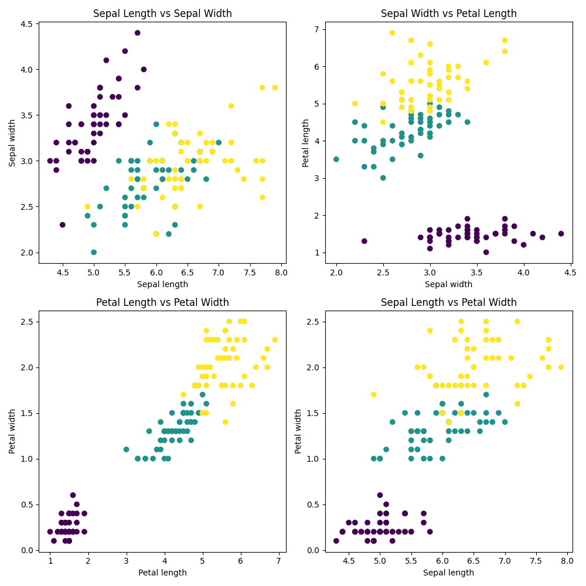

# Background Info
- We are using the `iris-dataset` which is an online dataset for classifying flowers based of petal shape and sepal shape
- It is a relatively small dataset - only used for learning

## Classification
- How do we determine 

### Visualisation of the classification
- We use `matplotlib` to visualise data. 

In this figure, you can see our attempt at trying to classify the different classes: Iris-setosa, Iris-versicolor and Iris-virginica:

## Evaluation 
